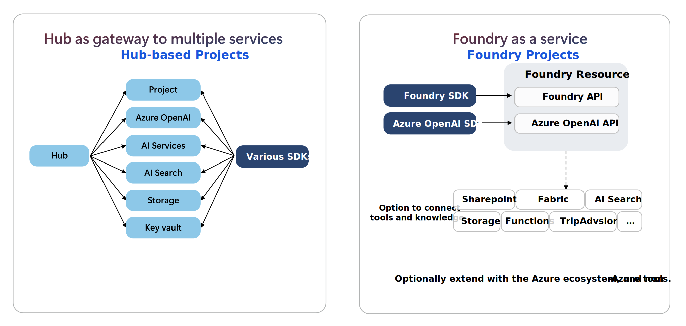

# Microsoft Foundry Enterprise Architecture Guide

*Current as of March 2026*

## TL;DR

- Foundry projects are the **recommended starting point** for most generative AI applications and agents
- Hub-based projects are primarily used when **Azure Machine Learning** capabilities are required (training, fine-tuning, custom model hosting)
- Enterprise networking typically integrates with the **Azure landing zone** (hub-spoke VNets, centralized DNS, firewall, Private Link)
- Model inference runs in **Microsoft-managed infrastructure** — not inside the customer VNet
- Private endpoints provide secure connectivity from VNets to AI services but **do not move the model runtime** into the VNet

## Overview

Microsoft Foundry is transitioning from a hub-based resource model — where multiple Azure resources were managed independently — to a unified **platform as a service**.



**Hub-based Project Architecture:** An AI Hub acts as shared infrastructure, and hub-based projects live within the hub. The hub provides centralized configuration and shared resources used by projects, such as connections to Azure OpenAI, AI Services, AI Search, Storage, and Key Vault.

**Foundry Project Architecture:** A Foundry Resource hosts Foundry projects directly — no hub required. Projects are created under the Foundry resource and provide isolated environments where developers build AI applications using models, agents, and tools. The Foundry resource exposes the Foundry API and Azure OpenAI–compatible APIs, accessed through the Foundry SDK or Azure OpenAI SDK. Tools and knowledge sources (SharePoint, Fabric, AI Search, Storage, Functions, etc.) can be connected as required.

**Architecture guidance:** Foundry projects are the recommended starting point for most generative AI applications and agents. Hub-based projects remain available for scenarios that require Azure Machine Learning capabilities, such as model training, fine-tuning, or hosting custom or open-source models. Microsoft is actively guiding customers with existing hub-based projects to [migrate to Foundry projects](https://learn.microsoft.com/azure/foundry-classic/how-to/migrate-project).

> **Important:** New generative AI and model-centric features are only available through Foundry projects. Some capabilities still require a hub (e.g. managed compute model hosting, Prompt flow) — see [What type of project do I need?](https://learn.microsoft.com/azure/foundry-classic/what-is-foundry#which-type-of-project-do-i-need) for the current support matrix.

### What this guide covers

From an infrastructure perspective, architects must decide between:

- **Foundry resource + projects** (default architecture)
- **Foundry resource + AI Hub + projects** (when ML capabilities are needed)

This guide focuses specifically on the **networking and governance implications** of each model for enterprise environments.

### Hub-Based vs Foundry Project Architecture

```
Hub-Based Model                         Foundry Project Model
──────────────────                      ─────────────────────
AI Hub                                  Foundry Resource
 ├── Project                             ├── Project
 ├── Azure OpenAI                        ├── Project
 ├── AI Services                         └── Project
 ├── Storage
 └── Key Vault

The hub centralized shared resources.    Projects are self-contained.
Networking was hub-scoped.               Connectivity configured per service.
Required managed VNet or BYOV.           Private endpoints per supporting service.
```

> **Note:** Microsoft's guidance on this topic is still scattered across Foundry docs, Azure ML docs, and networking guidance. This repo consolidates the current best practice based on available documentation and platform design.

---

## Resource Types

Microsoft Foundry supports multiple Azure resource types, each designed for different needs:

| Resource Type | Purpose |
|---|---|
| **Foundry** | The primary Azure resource. Scopes design, deployment, governance, and runtime for generative AI apps and agents. Includes agent service, models (Microsoft + partner), evaluations, Foundry Tools, and Azure OpenAI-compatible APIs. **This is the default.** |
| **Azure AI Hub** | Shared infrastructure resource that hosts hub-based projects. Provides Azure ML capabilities (managed compute, fine-tuning, Prompt flow). As of June 2025, most Hub capabilities have moved under the Foundry resource type. |
| **Azure OpenAI** | Specialized resource for OpenAI models and APIs only. The Foundry resource is a superset — you can [upgrade from Azure OpenAI to Foundry](https://learn.microsoft.com/azure/foundry-classic/how-to/upgrade-azure-openai) and keep your existing endpoint and config. |
| **Azure AI Search** | Separate resource for indexing and retrieval. Connected to Foundry for RAG scenarios. |

The Foundry resource is essentially an evolved, superset version of what previously required a Hub + Azure OpenAI + separate services, consolidated under one resource type.

### Resource Hierarchy

Full platform context — how Foundry resources fit within Azure:

```
Azure Subscription
      │
  Resource Group
      │
  Foundry Resource
      ├── Project (App A)
      ├── Project (App B)
      └── Project (App C)

Optional:
  AI Hub
      └── Hub-based Projects
```

### Two Types of Projects

There are two types of projects in Microsoft Foundry:

| Project Type | Parent Resource | When Used |
|---|---|---|
| **Foundry Project** | Foundry Resource | Default for generative AI apps and agents |
| **Hub-based Project** | Azure AI Hub | Used when Azure ML capabilities are required |

Both are projects, but they sit under different Azure resources.

- **Foundry Architecture (Default):** Foundry Resource → Foundry Projects → Models / Agents / APIs. Used for agents, copilots, RAG, generative AI apps, Azure OpenAI models.
- **Hub-based Architecture (ML Platform):** Azure AI Hub → Hub-based Projects → Azure ML Compute / Pipelines. Used for ML training, fine-tuning, OSS model hosting, ML pipelines, Prompt Flow.

### What is a Foundry Project?

Projects are **child resources** under a Foundry resource. They provide developers with self-serve capabilities to independently create new environments for exploring ideas and building prototypes, while managing data in isolation.

Projects act as secure units of isolation and collaboration where agents share file storage, thread storage (conversation history), and search indexes. You can also bring your own Azure resources for compliance and control over sensitive data.

Projects inherit security, networking, and governance settings from their parent Foundry resource. Once an admin configures RBAC, resource connectivity, and policies at the resource level, developers can create their own projects as folders to organize their work without needing admin involvement.

### Common Misconception: "All projects require a hub"

In the **old** Azure AI Studio model, every project required a hub. If you created a project without specifying one, a default hub was auto-created behind the scenes. This led to the belief that hubs are always required.

**This is no longer the case.**

In the current Foundry model, Foundry projects are created directly under a Foundry resource — no hub is involved. A Foundry Resource creates Foundry Projects (no hub), while an AI Hub creates Hub-based Projects (hub required).

These are **different project types** with different parent resources and different feature sets. A Foundry project is not the same as a hub-based project.

| | Foundry Project | Hub-based Project |
|---|---|---|
| Parent resource | Foundry resource | AI Hub |
| Hub required | No | Yes |
| New AI features | Yes | No (preview only) |
| Azure ML capabilities | No | Yes |
| Architecture model | Current / recommended | Specialized (ML-focused) |

> If you're starting new work, use a Foundry resource with Foundry projects. Only add an AI Hub if you need Azure ML capabilities that aren't yet available in Foundry projects.

---

## Foundry Resource vs. AI Hub

In Microsoft Foundry, the **Foundry resource + projects** is the default architecture.

A **Foundry AI Hub is optional** and mainly used when you need Azure Machine Learning capabilities.

### Default Architecture (Most Workloads)

Use Foundry resource + projects when building typical AI applications:

- Copilots
- RAG solutions
- Chatbots and agents
- Document processing
- API-based model inference

This is the recommended starting point for most deployments.

### When You Need a Foundry AI Hub

You add a Foundry AI Hub when you need features that come from Azure Machine Learning:

| Use case | Why Hub is needed |
|---|---|
| Host open-source models (Llama, Mistral, Phi) | Requires Azure ML compute |
| Fine-tune models | Uses Azure ML pipelines |
| Train custom models | Azure ML training environments |
| Deploy custom inference endpoints | ML model hosting |
| ML experimentation workflows | Azure ML workspace features |

Projects are created under the Hub, which sits under the Foundry Resource.

### Key Distinction for Infrastructure Architects

**The Hub is not primarily about networking. It is mainly about ML infrastructure capabilities.**

Networking centralization is a secondary benefit, not the primary reason to adopt a Hub.

If your only goal is centralized networking, you can achieve that through your landing zone architecture (hub VNet, centralized DNS, Azure Firewall) without deploying a Foundry AI Hub.

### Feature Parity: Foundry Project vs Hub-Based Project

*Current as of March 2026*

Not all features are available in both project types. This table summarizes the current state. For the official and always up-to-date comparison, see [Which type of project do I need?](https://learn.microsoft.com/azure/foundry-classic/what-is-foundry#which-type-of-project-do-i-need) in the Microsoft docs.

| Feature | Foundry Project | Hub-Based Project |
|---|---|---|
| Agents | GA | Preview only |
| Azure OpenAI, DeepSeek, xAI, etc. | Yes | Via connections |
| Partner & Community Models (Marketplace) | Yes | Via connections |
| Models on managed compute (e.g. HuggingFace) | No | Yes |
| Foundry SDK and API | Yes | Limited |
| OpenAI SDK and API | Yes | Via connections |
| Evaluations | Preview | Yes |
| Playgrounds | Yes | Yes |
| Content understanding | Yes | Yes |
| Azure Language resource | No | Yes |
| Prompt flow | No | Yes |
| Model router | Yes | Yes |
| Datasets | Yes | Yes |
| Indexes | Yes | Yes |
| Project files API (Foundry-managed storage) | Yes | Limited |
| Project-level isolation of files and outputs | Yes | Limited |
| Bring-your-own Key Vault | Yes | Yes |
| Bring-your-own Storage for Agent service | Yes | Yes |

> New feature enhancements primarily land on the Foundry project type. For the latest matrix, see [What type of project do I need?](https://learn.microsoft.com/azure/foundry-classic/what-is-foundry#which-type-of-project-do-i-need)

### Networking Impact

A Hub introduces additional compute and storage resources that require their own private endpoint coverage. Standalone Foundry projects have a simpler networking footprint since they only consume managed API endpoints.

This distinction directly affects the number of private endpoints, DNS zones, and firewall rules required in your environment.

### Portal Experience

Microsoft Foundry has two portal experiences. The "classic" label refers to the **portal**, not the project type — both Foundry projects and hub-based projects are accessible through the classic portal.

| Portal | What it shows |
|---|---|
| **Microsoft Foundry (new)** | Foundry projects only |
| **Microsoft Foundry (classic)** | Foundry projects, hub-based projects, Azure OpenAI resources, and hubs |

- If you work exclusively with Foundry projects, either portal works.
- If you manage hubs, hub-based projects, or Azure OpenAI resources, you need the classic portal.
- A toggle in the portal banner lets you switch between the two.

### Where Microsoft Is Heading

The new Foundry portal experience is project-centric, which strongly suggests the long-term architecture will be Foundry Resource → Projects directly. Hubs will likely remain as advanced ML infrastructure layers for organizations that need them.

---

## What Runs Inside Your Network

Model inference services remain Microsoft-managed services — the model runtime does not run inside the customer VNet. Private endpoints provide secure connectivity to these services but do not move the runtime into the customer network.

Networking is used to securely access supporting services:

| Service | Role |
|---|---|
| Azure OpenAI | Model inference endpoint |
| Azure Storage | Prompts, datasets, artifacts |
| Azure AI Search | Retrieval for RAG solutions |
| Azure Key Vault | Secret management |

Private endpoints in the customer VNet provide secure access to Azure OpenAI / Foundry services running on Microsoft-managed infrastructure.

---

## Decision Guide

| Scenario | Recommendation |
|---|---|
| Standard AI application | Foundry resource + projects |
| Multiple apps from different teams | Multiple projects |
| Need ML training / fine-tuning | Add Foundry AI Hub |
| Running open-source models | Add Foundry AI Hub |
| Centralized governance required | Hub-based or landing zone networking |

| Factor | Foundry Projects Only | Hub with Projects |
|---|---|---|
| Team autonomy | High — team owns everything | Moderate — inherits hub config |
| Networking control | Per-project (or via landing zone) | Centralized at hub |
| Governance overhead | Higher per project | Lower — enforced at hub |
| Infrastructure reuse | None | Shared endpoints, models, connections |
| Setup complexity | Simpler for one project | Simpler at scale |
| Isolation | Full | Logical separation within hub |
| ML capabilities | Not available | Full Azure ML access |

**Rule of thumb:**

- **One team, one app, API-based models** → Foundry resource + projects
- **Multiple teams, shared platform** → Hub with projects
- **Fine-tuning or open-source model hosting** → Hub required
- **Centralized networking only** → Landing zone architecture (Hub not required)

---

## Enterprise Architecture Tradeoffs

While the Foundry resource + projects model simplifies development and isolation, enterprise platform teams should consider several operational tradeoffs when designing large-scale environments.

### PTU Capacity Fragmentation

Provisioned Throughput Units (PTUs) are allocated per model deployment.

In hub-based architectures, multiple projects can share the same model deployment and PTU capacity. This can improve cost efficiency for models that are used across many applications.

With standalone Foundry projects, PTUs may be allocated independently per project, which can reduce economies of scale if multiple teams deploy the same models separately.

Organizations with high shared model usage may prefer centralized model deployments to optimize PTU utilization.

### Disaster Recovery Design

The Foundry resource is region-bound, so disaster recovery typically requires deploying an additional Foundry resource per region, which can increase duplication compared to hub-based designs.

Typical DR pattern:

```
Primary Region
   Foundry Resource
      ├── Project A
      └── Project B

Secondary Region
   Foundry Resource
      ├── Project A
      └── Project B
```

Hub-based architectures can reduce duplication of infrastructure if multiple projects share a hub.

### Centralized API Gateway Patterns

Many enterprises expose AI services through centralized gateways such as:

- Azure API Management
- Application Gateway
- AI Gateway patterns

With standalone Foundry resources, each resource may need to be registered as a backend service behind the gateway.

Hub-based architectures can simplify gateway configuration because multiple projects share the same backend infrastructure.

### Shared Connections and Tools

Hub-based architectures allow shared connections to services such as:

- Azure AI Search
- Storage accounts
- Azure Functions
- External APIs

Connections and tools are project-scoped, so sharing common data sources now requires per-project configuration and automation.

While this increases management overhead, project-scoped connections and isolation significantly reduce blast radius and simplify compliance for regulated workloads.

---

## Enterprise Networking Architecture (Landing Zone Pattern)

Microsoft Foundry deployments typically integrate with an existing Azure Landing Zone networking architecture.

The goal is to provide secure private connectivity between enterprise networks and AI services while maintaining centralized network governance.

> **Diagram:** [foundry-enterprise-networking.drawio](diagrams/foundry-enterprise-networking.drawio) — open in [draw.io](https://app.diagrams.net) or VS Code with the [Draw.io Integration](https://marketplace.visualstudio.com/items?itemName=hediet.vscode-drawio) extension.

Typical architecture flow:

```
Corporate Network / On-premises
        │
ExpressRoute or Site-to-Site VPN
        │
Azure Hub VNet
        │
Azure Firewall / NVA
        │
Private DNS Zones
        │
Private Endpoints
        │
Azure AI Foundry services
```

### Hub Virtual Network

Most enterprise environments use a hub VNet to centralize networking services.

Typical hub components include:

- Azure Firewall or NVA
- Private DNS zones
- ExpressRoute gateway
- VPN gateway
- Shared private endpoints

Spoke VNets may host:

- Application workloads
- Container environments
- Data services

### Private Endpoints

Enterprise deployments usually disable public network access and rely on Private Link.

Common private endpoints used with AI workloads:

| Service | Purpose |
|---|---|
| Azure OpenAI | Model inference |
| Azure Storage | Prompts, datasets, artifacts |
| Azure AI Search | RAG data retrieval |
| Azure Key Vault | Secrets and encryption keys |

Private endpoints allow services to be accessed through private IP addresses inside the VNet.

### Private DNS

Private endpoints require correct DNS resolution.

Common zones include:

- `privatelink.openai.azure.com`
- `privatelink.cognitiveservices.azure.com`
- `privatelink.blob.core.windows.net`
- `privatelink.vaultcore.azure.net`

In enterprise environments these zones are typically:

- Hosted in the hub VNet
- Linked to multiple VNets
- Integrated with on-premises DNS forwarders

> **Note:** DNS misconfiguration is the most common cause of private endpoint connectivity failures.

### Network Security

Enterprise deployments usually enforce outbound inspection using:

- Azure Firewall
- Network Virtual Appliances
- Corporate egress filtering

Common security controls include:

- Restricting outbound FQDN access
- Blocking public internet access
- Enforcing TLS inspection policies
- Logging outbound AI service traffic

This ensures AI services follow the same security model as other enterprise workloads.

### Hub vs Project Networking Implications

| Model | Networking Ownership |
|---|---|
| Foundry Projects Only | Each project manages its own private endpoints, or networking is centralized via landing zone |
| Hub-based | Networking configured once at the hub and inherited by projects |

Hub-based architectures reduce duplication of private endpoints, DNS configuration, firewall rules, and network governance policies.

However, if centralized networking is your only goal, a landing zone hub-spoke architecture achieves this without requiring a Foundry AI Hub.

### Identity and Access Security

Identity is a critical security boundary for Foundry deployments. Misconfigured RBAC or overly broad permissions are as dangerous as an open network.

#### Managed Identities

All Foundry resources should use managed identities for service-to-service authentication — never keys or connection strings in production.

| Resource | Identity Type | Purpose |
|---|---|---|
| Foundry Resource | System-assigned | Authenticate to dependent Azure services |
| Foundry Project | System-assigned | Project-scoped access to Storage, Key Vault, AI Search |
| Application (App Service, AKS, etc.) | User-assigned | Application access to Foundry endpoints |

**Recommendation:** Use system-assigned identities for Foundry resources and projects. Use user-assigned identities for applications that consume Foundry APIs — this allows identity lifecycle to be managed independently of the application deployment.

#### RBAC Model

Foundry uses Azure RBAC with resource-scoped roles. Follow least-privilege principles:

| Role | Scope | Who |
|---|---|---|
| Azure AI Developer | Project | Developers building AI applications |
| Azure AI Inference Deployment Operator | Foundry resource | Platform team managing model deployments |
| Contributor | Foundry resource | Platform admins provisioning infrastructure |
| Reader | Resource group | Security and audit teams |
| Key Vault Secrets User | Key Vault | Managed identities that need secrets |
| Storage Blob Data Contributor | Storage account | Projects that read/write data |

**Do not** assign Contributor or Owner at the resource group level to developers. Scope access to the project level.

#### Conditional Access

For portal and API access, enforce conditional access policies:

- Require MFA for all users accessing the Foundry portal
- Restrict access to compliant / managed devices
- Block access from untrusted locations
- Require compliant network locations (named locations aligned with your corporate network)

These policies apply to both the Microsoft Foundry portal and API calls authenticated through Entra ID.

#### Audit and Monitoring

Configure diagnostic settings to capture identity and access events:

| Log Category | Where | What It Captures |
|---|---|---|
| Activity Log | Resource group | Resource creation, deletion, RBAC changes |
| Diagnostic Logs | Foundry resource | API calls, model inference requests, token usage |
| Sign-in Logs | Entra ID | User and service principal authentication |
| Audit Logs | Entra ID | RBAC assignments, conditional access evaluation |

Send all logs to a **central Log Analytics workspace**. Set up alerts for:

- RBAC changes on Foundry resources (role assignments added/removed)
- Failed authentication attempts
- Access from unusual locations
- High-volume inference calls (potential abuse or misconfigured applications)

### Governance

#### Azure Policy

Enforce security baselines with Azure Policy:

| Policy | Purpose |
|---|---|
| Deny public network access on Cognitive Services | Ensure private endpoints are required |
| Require private endpoints on Storage, Key Vault, AI Search | Prevent public data access |
| Deny RBAC assignments above project scope for non-admins | Prevent privilege escalation |
| Require diagnostic settings | Ensure logging is enabled |
| Allowed locations | Enforce data residency |

#### Environment Separation

Separate Dev, Test, and Production at the resource level. Use separate Foundry resources per environment — not just separate projects under the same resource (e.g. a Production Resource Group with a Prod Foundry Resource, and a separate Dev/Test Resource Group with a Dev Foundry Resource). This ensures:

- Independent RBAC boundaries
- Separate networking configuration
- Independent key rotation and secret management
- Clear cost attribution

### Infrastructure Design Recommendations

For most enterprise environments:

- Deploy AI networking through the landing zone hub network
- Use Private Link for all AI service connectivity
- Centralize private DNS zones
- Enforce outbound security controls through Azure Firewall
- Separate Dev / Test / Production AI environments

This approach aligns AI deployments with standard enterprise cloud architecture patterns.

---

## Data Protection

AI workloads handle sensitive data — prompts, responses, training data, embeddings, and secrets. Data protection must cover data at rest, in transit, and in use.

### Encryption at Rest

All Azure services used by Foundry encrypt data at rest by default using Microsoft-managed keys.

For regulated environments, use **customer-managed keys (CMK)** stored in Azure Key Vault:

| Service | CMK Support | Key Vault Requirement |
|---|---|---|
| Azure Storage | Yes | Key Vault with soft delete and purge protection |
| Azure AI Search | Yes | Key Vault with soft delete and purge protection |
| Azure Key Vault | N/A (Key Vault itself) | — |
| Azure OpenAI | Yes | Key Vault with soft delete and purge protection |

**Recommendation:** Enable CMK on Storage and AI Search first — these hold customer data (prompts, datasets, indexes). Azure OpenAI CMK covers fine-tuning data and stored completions.

### Encryption in Transit

All traffic between your VNet and Azure services over Private Link uses TLS 1.2+. This is enforced by the platform.

If you use Azure Firewall with TLS inspection:

- Ensure the Firewall CA certificate is trusted by clients
- Be aware that TLS inspection adds latency to inference calls
- Some organizations exempt AI service traffic from TLS inspection for performance — this is a risk/performance tradeoff to evaluate per your security posture

### Data Exfiltration Prevention

Preventing data from leaving your controlled environment is a key concern for enterprise AI deployments.

**Network-level controls:**

- Disable public network access on all supporting services
- Use Azure Firewall to restrict outbound destinations
- Use NSGs on spoke subnets to limit traffic to known private endpoints
- Block copy/export to unauthorized storage accounts using Azure Policy

**Service-level controls:**

- Restrict Storage account access to specific VNets and private endpoints
- Use Storage account firewall rules alongside private endpoints
- Disable shared key access on Storage — require Entra ID authentication only
- Limit AI Search index access to specific managed identities

**Identity-level controls:**

- Scope RBAC to project level to prevent cross-project data access
- Use Conditional Access to restrict portal access to managed devices
- Monitor for bulk data export patterns in diagnostic logs

### Data Residency

Foundry resources are region-scoped. Data processed and stored by supporting services stays within the region they're deployed in.

For sovereignty requirements:

- Deploy all resources in the required region(s)
- Use Azure Policy to enforce allowed locations
- Be aware that model inference may involve Microsoft-managed infrastructure in the same region — confirm with Microsoft support for specific compliance requirements
- For EU data boundary, review [Microsoft EU Data Boundary documentation](https://learn.microsoft.com/privacy/eudb/eu-data-boundary-learn)

---

## Common Azure AI Foundry Networking Mistakes (Field Notes)

### 1. Missing or incorrect private DNS zones

Private endpoints are created but DNS zones are not linked to the correct VNets. Services resolve to public IPs instead of private IPs, causing connectivity failures or traffic leaving the private network.

**Fix:** Verify DNS resolution from within the VNet using `nslookup`. The response should return a private IP address (10.x, 172.16.x, etc.), not a public IP.

### 2. Assuming the model runs in your VNet

Teams design network architecture expecting to host the AI model runtime inside their VNet. Azure AI Foundry services are Microsoft-managed — your VNet provides secure access to them via private endpoints, not hosting.

**Fix:** Design for private endpoint connectivity to managed services, not for compute placement inside your network.

### 3. Public access left enabled alongside private endpoints

Private endpoints are deployed, but public network access is not disabled on the service. Traffic may still route over the public internet depending on DNS resolution.

**Fix:** Explicitly disable public network access on Azure OpenAI, Storage, AI Search, and Key Vault after private endpoints are confirmed working.

### 4. Firewall not configured for AI service FQDNs

Azure Firewall or NVA blocks outbound traffic to Azure AI service endpoints. Model inference calls fail silently or timeout.

**Fix:** Add application rules for required AI service FQDNs. Review Azure documentation for the current list of required endpoints for Azure OpenAI and related services.

### 5. Duplicated networking across standalone projects

Multiple teams each deploy their own private endpoints, DNS zones, and firewall rules. Configuration drifts, costs increase, and troubleshooting becomes fragmented.

**Fix:** Evaluate whether a hub-based architecture would centralize networking and reduce operational overhead. If standalone projects are required, enforce consistent configuration through Azure Policy.

---

## References

- [Foundry projects](https://learn.microsoft.com/azure/foundry/concepts/project)
- [Foundry AI hubs](https://learn.microsoft.com/azure/foundry/concepts/hub)
- [Migrate from hub-based to Foundry projects](https://learn.microsoft.com/azure/foundry-classic/how-to/migrate-project)
- [What type of project do I need?](https://learn.microsoft.com/azure/foundry-classic/what-is-foundry#which-type-of-project-do-i-need)
- [Azure ML integration](https://learn.microsoft.com/azure/machine-learning/)
- [Private endpoint networking for AI Foundry](https://learn.microsoft.com/azure/ai-foundry/concepts/network-security)
- [Sample Bicep templates](https://github.com/azure-ai-foundry/foundry-samples/tree/main/infrastructure/infrastructure-setup-bicep/01-connections)
- [Sample Terraform templates](https://github.com/azure-ai-foundry/foundry-samples/tree/main/infrastructure/infrastructure-setup-terraform/)

---

## License

MIT License
